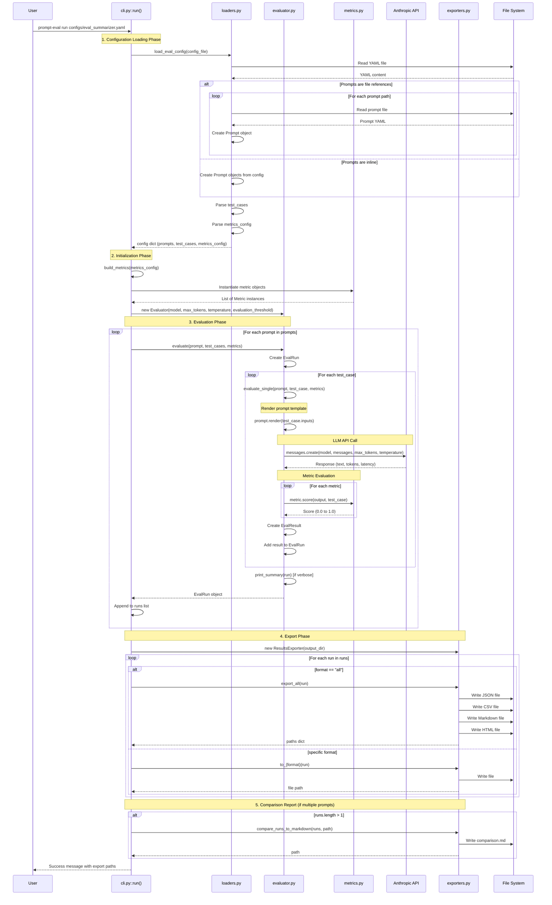

# Technical Documentation

## Overview

The Prompt Evaluation Pipeline is a declarative YAML-based framework for testing and comparing LLM prompts. The architecture follows a single-config approach where all evaluation components (prompts, test cases, metrics, and settings) are defined in YAML configuration files.

## Architecture

### Core Components

1. **CLI Layer** (`cli.py`)
   - Entry point for user interaction
   - Parses command-line arguments
   - Orchestrates the evaluation workflow

2. **Configuration Layer** (`loaders.py`)
   - Loads and parses YAML/JSON configuration files
   - Supports both external prompt file references and inline definitions
   - Validates configuration structure

3. **Evaluation Engine** (`evaluator.py`)
   - Executes prompt evaluations against test cases
   - Manages LLM API calls (Anthropic Claude)
   - Calculates metrics and aggregates results

4. **Metrics System** (`metrics.py`)
   - Pluggable metric implementations
   - Supports multiple evaluation criteria (contains, length, LLM judge, etc.)

5. **Export Layer** (`exporters.py`)
   - Generates reports in multiple formats (JSON, CSV, Markdown, HTML)
   - Creates comparison reports for multi-prompt evaluations

6. **Data Models** (`models.py`)
   - Pydantic models for type safety and validation
   - Core entities: `Prompt`, `TestCase`, `EvalResult`, `EvalRun`

## Command Flow: `prompt-eval run configs/eval_summarizer.yaml`

### Sequence Diagram



## Data Flow

### 1. Configuration Loading

**Input:** `configs/eval_summarizer.yaml`

```yaml
model: claude-sonnet-4-20250514
max_tokens: 256
temperature: 0.0
evaluation_threshold: 0.5  # Minimum score for tests to pass (0.0-1.0)

prompts:
  - ../prompts/summarizer_v1.yaml  # External reference
  - name: inline_prompt             # Inline definition
    template: "..."

test_cases:
  - name: test1
    inputs: {text: "...", max_sentences: 2}
    expected_contains: ["keyword"]

metrics:
  - type: contains
  - type: response_length
    max_words: 100
```

**Output:** Python dict with parsed objects

```python
{
    "model": "claude-sonnet-4-20250514",
    "max_tokens": 256,
    "temperature": 0.0,
    "evaluation_threshold": 0.5,
    "prompts": [Prompt(...), Prompt(...)],        # Pydantic models
    "test_cases": [TestCase(...), TestCase(...)],  # Pydantic models
    "metrics_config": [{"type": "contains"}, ...]  # Raw config
}
```

### 2. Prompt Rendering

For each test case, the prompt template is rendered with input variables:

```python
# Template
"Summarize this in {max_sentences} sentences:\n\n{text}"

# Inputs
{"text": "Python is...", "max_sentences": 2}

# Rendered
"Summarize this in 2 sentences:\n\nPython is..."
```

### 3. LLM Evaluation

```python
response = client.messages.create(
    model="claude-sonnet-4-20250514",
    max_tokens=256,
    temperature=0.0,
    messages=[{
        "role": "user",
        "content": rendered_prompt
    }]
)
```

### 4. Metric Scoring

Each metric evaluates the LLM output:

- **Contains**: Checks for required/forbidden substrings
- **ResponseLength**: Validates word/character counts
- **LLMJudge**: Uses another LLM to score quality
- **ExactMatch**: Exact string comparison

Returns score: `0.0` (fail) to `1.0` (pass)

### 5. Result Aggregation

```python
EvalResult(
    test_case="test1",
    prompt_name="summarizer_v1",
    output="Python is a programming language...",
    metrics={"contains": 1.0, "response_length": 1.0},
    passed=True,  # All metrics >= evaluation_threshold (default 0.5)
    latency_ms=245.3,
    tokens_in=50,
    tokens_out=30
)
```

Multiple `EvalResult` objects are collected into an `EvalRun`:

```python
EvalRun(
    run_id="abc123",
    prompt_name="summarizer_v1",
    model="claude-sonnet-4-20250514",
    results=[result1, result2, result3],
    pass_rate=1.0,  # 100% passed
    avg_latency_ms=245.3
)
```

## File Structure

```
prompt-eval-pipeline/
├── src/prompt_eval/
│   ├── __init__.py           # Package initialization, env loading
│   ├── cli.py                # CLI entry point, command handlers
│   ├── loaders.py            # YAML/JSON parsing, config loading
│   ├── models.py             # Pydantic data models
│   ├── evaluator.py          # Evaluation engine, LLM orchestration
│   ├── metrics.py            # Metric implementations
│   └── exporters.py          # Result export to JSON/CSV/MD/HTML
├── prompts/                  # Reusable prompt library
│   ├── summarizer_v1.yaml
│   ├── summarizer_v2.yaml
│   └── summarizer_v3.yaml
├── configs/                  # Evaluation configurations
│   └── eval_summarizer.yaml
├── results/                  # Generated reports (git-ignored)
│   ├── {prompt}_{run_id}_{timestamp}.json
│   ├── {prompt}_{run_id}_{timestamp}.csv
│   ├── {prompt}_{run_id}_{timestamp}.md
│   ├── {prompt}_{run_id}_{timestamp}.html
│   └── comparison.md         # If multiple prompts
└── pyproject.toml            # Project metadata
```

## Key Design Patterns

### 1. Strategy Pattern (Metrics)

Each metric implements the `Metric` abstract base class:

```python
class Metric(ABC):
    @abstractmethod
    def score(self, output: str, test_case: TestCase) -> float:
        pass

    def passes(self, output: str, test_case: TestCase, threshold: float = 0.5) -> bool:
        return self.score(output, test_case) >= threshold
```

### 2. Builder Pattern (Metrics)

The `build_metrics()` function constructs metric instances from YAML config:

```python
def build_metrics(metrics_config: list[dict]) -> list:
    metrics = []
    for config in metrics_config:
        if config["type"] == "contains":
            metrics.append(Contains(case_sensitive=config.get("case_sensitive", False)))
        elif config["type"] == "llm_judge":
            metrics.append(LLMJudge(criteria=config["criteria"], model=config.get("model")))
        # ... more metrics
    return metrics or [Contains()]  # Default metric
```

### 3. Template Method Pattern (Exporters)

The `ResultsExporter` class provides multiple export methods with a common structure:

```python
class ResultsExporter:
    def to_json(self, run: EvalRun, path: Path = None) -> Path:
        # Convert to JSON format
        # Write to file
        # Return path

    def to_csv(self, run: EvalRun, path: Path = None) -> Path:
        # Convert to CSV format
        # Write to file
        # Return path
```

### 4. Facade Pattern (Evaluator)

The `Evaluator` class provides a simple interface to complex evaluation logic:

```python
evaluator = Evaluator(model="claude-sonnet-4-20250514")
run = evaluator.evaluate(prompt, test_cases, metrics)
# Hides: template rendering, API calls, metric scoring, result aggregation
```

## Configuration Options

### Global Configuration Parameters

These parameters are set at the top level of your evaluation config file:

```yaml
# configs/eval_config.yaml
model: claude-sonnet-4-20250514     # LLM model to use
max_tokens: 1024                     # Maximum tokens in response
temperature: 0.0                     # Sampling temperature (0.0 = deterministic)
evaluation_threshold: 0.5            # Minimum score for tests to pass (0.0-1.0)
```

#### evaluation_threshold

Controls how strict the evaluation is. Sets the minimum score (0.0 to 1.0) that **ALL** metrics must achieve for a test to pass.

**Default:** `0.5` (50% match required)

**How it works:**
- Each metric returns a score between 0.0 (complete failure) and 1.0 (perfect match)
- A test passes only if **ALL** metrics score >= `evaluation_threshold`
- Different thresholds can be set for different evaluation configs

**Example - Contains Metric:**
```yaml
test_cases:
  - name: example
    expected_contains:
      - "string1"
      - "string2"
      - "string3"
```

If the output contains only 2 out of 3 strings:
- Metric score: 0.667 (2/3 = 66.7%)
- `evaluation_threshold: 0.5` → **PASS** (0.667 >= 0.5)
- `evaluation_threshold: 1.0` → **FAIL** (0.667 < 1.0)

**When to use strict thresholds (0.8-1.0):**
- Extracting structured data where partial matches are incorrect
- Validating exact output formats
- Classification tasks requiring high precision
- Critical business logic where accuracy is paramount

**When to use lenient thresholds (0.5-0.7):**
- General response quality validation
- Testing that key concepts are present
- Allowing flexibility in phrasing
- Early-stage prompt development

**Implementation:**
```python
# In evaluator.py
passed = all(score >= self.evaluation_threshold for score in metric_scores.values())
```

### Prompt Configuration

**External File Reference:**
```yaml
prompts:
  - ../prompts/summarizer_v1.yaml
```

**Inline Definition:**
```yaml
prompts:
  - name: my_prompt
    description: "A custom prompt"
    version: "1.0"
    system: "You are a helpful assistant."
    template: "Answer: {question}"
```

### Test Case Configuration

```yaml
test_cases:
  - name: test_name
    inputs:                        # Variables for prompt template
      question: "What is Python?"
      style: "brief"
    expected_contains:             # Required substrings
      - "programming"
    expected_not_contains:         # Forbidden substrings
      - "I don't know"
    tags:                          # For filtering (future use)
      - basic
      - programming
```

### Metrics Configuration

**Contains:**
```yaml
metrics:
  - type: contains
    case_sensitive: false  # Optional
```

**Response Length:**
```yaml
metrics:
  - type: response_length
    min_words: 10
    max_words: 100
    min_chars: 50     # Optional
    max_chars: 500    # Optional
```

**LLM Judge:**
```yaml
metrics:
  - type: llm_judge
    criteria: |
      Evaluate on:
      1. Accuracy
      2. Clarity
      3. Completeness
    model: claude-sonnet-4-20250514  # Optional
    threshold: 0.7                    # Optional
```

**Exact Match:**
```yaml
metrics:
  - type: exact_match
    case_sensitive: true
    strip: true
```

## Error Handling

### Configuration Errors

- **Missing config file**: Clear error message with file path
- **Invalid YAML**: Parsing error with line number
- **Missing required fields**: Validation error from Pydantic
- **Invalid prompt path**: FileNotFoundError with helpful message

### Runtime Errors

- **LLM API errors**: Caught and stored in `EvalResult.error` field
- **Metric errors**: Individual metric failures don't stop evaluation
- **Export errors**: Directory creation failures handled gracefully

## Performance Considerations

### API Rate Limiting

- Sequential evaluation of test cases (no parallelization)
- Respects Anthropic API rate limits
- Token usage tracked per evaluation

### Memory Usage

- Streaming not currently implemented (full responses loaded)
- Results kept in memory until export
- Large configs with many test cases may require optimization

### Disk I/O

- Config files read once at startup
- Results written after all evaluations complete
- Multiple export formats generated in parallel

## Extension Points

### Adding New Metrics

1. Create new class in `metrics.py` inheriting from `Metric`
2. Implement `score()` method
3. Add to `build_metrics()` in `cli.py`

```python
class CustomMetric(Metric):
    name = "custom"

    def score(self, output: str, test_case: TestCase) -> float:
        # Custom scoring logic
        return score  # 0.0 to 1.0
```

### Adding New Export Formats

1. Add method to `ResultsExporter` class
2. Update CLI format choices

```python
def to_xml(self, run: EvalRun, path: Path = None) -> Path:
    # Convert to XML
    # Write file
    return path
```

### Adding New Commands

Currently only `run` command exists. Future commands could be added:

```python
@main.command()
def validate(config_file: str):
    """Validate config without running evaluation."""
    # Implementation
```

## Testing Strategy

### Unit Tests (Planned)

- Test each metric independently
- Test prompt rendering
- Test config loading with various inputs
- Mock LLM API calls

### Integration Tests (Planned)

- End-to-end test with sample config
- Test all export formats
- Test error handling paths

### Manual Testing

Current approach: Run with example configs and verify outputs

## Future Enhancements

1. **Parallel Evaluation**: Run test cases concurrently
2. **Streaming Responses**: Handle long outputs efficiently
3. **Caching**: Cache LLM responses for repeated evaluations
4. **Advanced Filtering**: Use test case tags to run subsets
5. **CI/CD Integration**: GitHub Actions workflow for automated testing
6. **Web UI**: Dashboard for viewing results
7. **Cost Tracking**: Track API costs per evaluation
8. **Regression Testing**: Compare results across prompt versions

## Dependencies

### Production Dependencies

- **anthropic** (>=0.40.0): Claude API client
- **pydantic** (>=2.0.0): Data validation and parsing
- **pyyaml** (>=6.0): YAML file parsing
- **rich** (>=13.0.0): Terminal formatting and progress bars
- **pandas** (>=2.0.0): CSV export and data manipulation
- **jinja2** (>=3.0.0): Template rendering (future use)
- **click** (>=8.0.0): CLI framework
- **python-dotenv** (>=1.0.0): Environment variable loading

### Development Dependencies

- **pytest** (>=7.0.0): Testing framework
- **pytest-asyncio** (>=0.21.0): Async test support

## Environment Variables

**Required:**
- `ANTHROPIC_API_KEY`: API key for Claude

**Optional:**
- None currently, but could add:
  - `PROMPT_EVAL_CACHE_DIR`: Cache directory for responses
  - `PROMPT_EVAL_LOG_LEVEL`: Logging verbosity

## CLI Reference

### Command: `run`

Execute evaluation from a config file.

**Usage:**
```bash
prompt-eval run <config_file> [OPTIONS]
```

**Arguments:**
- `config_file`: Path to YAML configuration file

**Options:**
- `-o, --output PATH`: Output directory (default: results/)
- `-f, --format [json|csv|markdown|html|all]`: Export format (default: all)
- `-m, --model TEXT`: Override model from config
- `-v, --verbose`: Verbose output (default: True)
- `-q, --quiet`: Minimal output

**Examples:**
```bash
# Basic usage
prompt-eval run configs/eval_summarizer.yaml

# Custom output directory
prompt-eval run configs/eval_summarizer.yaml -o my_results/

# Only JSON export
prompt-eval run configs/eval_summarizer.yaml -f json

# Override model
prompt-eval run configs/eval_summarizer.yaml -m claude-opus-4-5-20251101

# Quiet mode
prompt-eval run configs/eval_summarizer.yaml --quiet
```

## Troubleshooting

### Common Issues

**Issue:** "No prompts found in config!"
- **Cause:** Config file missing `prompts` section
- **Fix:** Add prompts section with at least one prompt

**Issue:** "No test cases found in config!"
- **Cause:** Config file missing `test_cases` section
- **Fix:** Add test_cases section with at least one test

**Issue:** "FileNotFoundError: prompts/xyz.yaml"
- **Cause:** Referenced prompt file doesn't exist or wrong path
- **Fix:** Check prompt file path is relative to config file location

**Issue:** API errors (401, 429, etc.)
- **Cause:** Invalid API key or rate limiting
- **Fix:** Check ANTHROPIC_API_KEY in .env file, wait and retry

## Version History

- **0.1.0** (Current): Initial release with single `run` command, YAML-based config, multiple metrics and export formats
